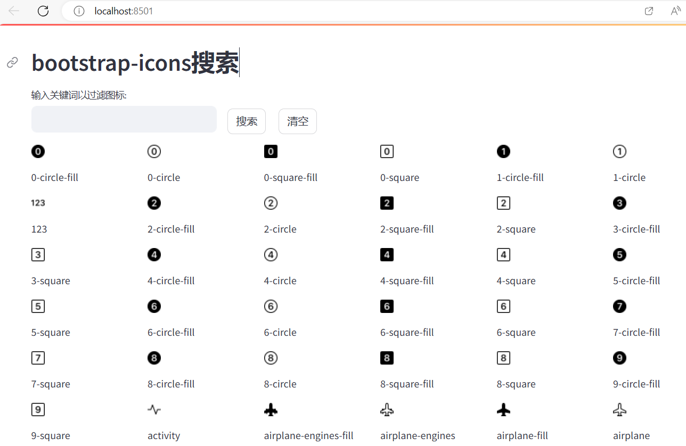
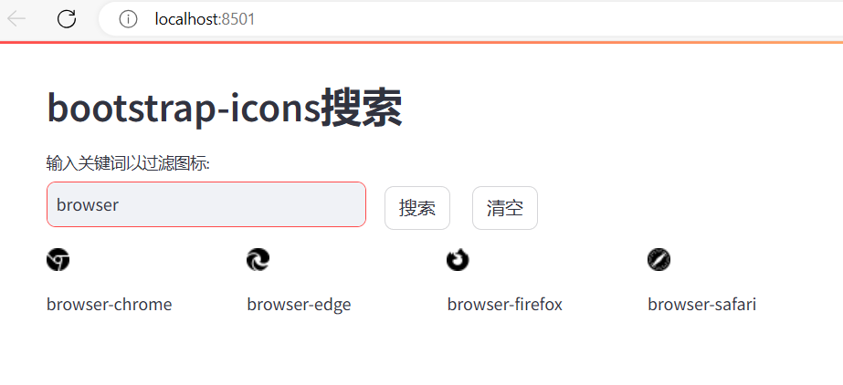

# streamlit-bootstrap-icons-search
search-bootstrap-icons
## 需要用到的库cairosvg
```python
pip install cairosvg
```
cairosvg 库将svg改为png。
这个库可以不用，直接用streamlit的image组件加载svg，但页面加载会慢一些。

## 全部图标

## 搜索后图标

